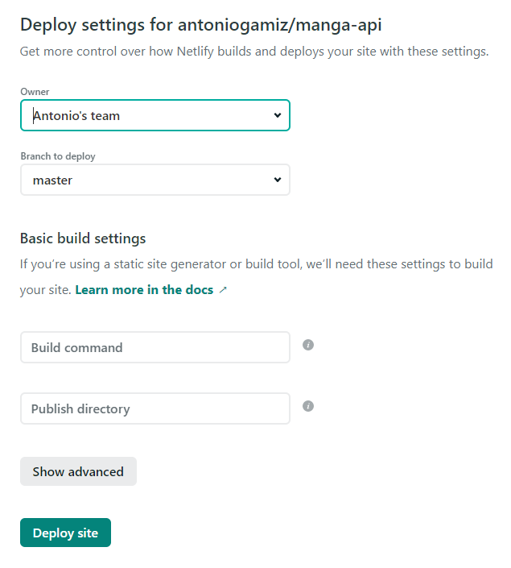
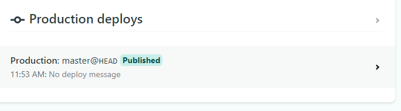
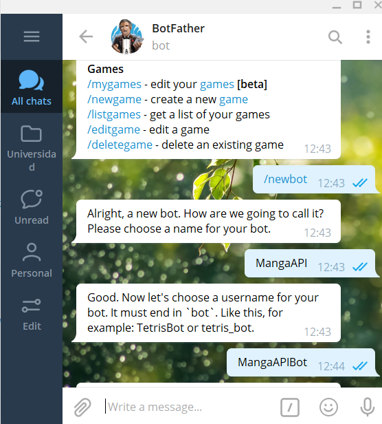
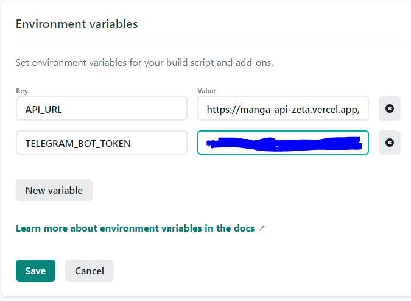

# Bot

Para crear el bot de Telegram para consultar mi API, voy a usar Node en lugar de Deno. Esto se debe a que quiero desplegar el bot en Netlify, pero esa plataforma no tiene soporte para Deno.

Para crear el bot voy a usar la librería [Telegraf](https://telegraf.js.org/), que tiene un uso muy extendido y una gran documentación.

El objetivo es crear un bot sencillo que simplemente mapee los comandos necesarios a nuestra API ya creada y desplegada en [Vercel](https://manga-api-zeta.vercel.app/).

## Setup Netlify

Netlify ya lo tengo configurado ya que ese era uno de los ejercicios de autoevaluación (la solución puede ser consultada [aquí](https://github.com/antoniogamiz/iv-autoevaluacion#hito-5)). Simplemente queda conectar el repositorio:

Después tenemos que crear un fichero [netlify.toml](https://github.com/antoniogamiz/manga-api/blob/master/netlify.toml) indicando dónde se encuentran nuestras funciones. Vamos a usar [functions](https://github.com/antoniogamiz/manga-api/tree/master/functions) en lugar de `api` para diferenciarlas de las funciones de Vercel.

Después, creamos una función simple de [health](https://github.com/antoniogamiz/manga-api/blob/master/functions/health.js) para ver que todo funciona correctamente.

En la siguiente [URL](https://upbeat-archimedes-878dc0.netlify.app/.netlify/functions/health) se puede comprobar el correcto funcionamiento de nuestra función.

## Telegram Bot

Lo primero que tenemos que hacer es hablar con `BotFather` para crear nuestro bot y obtener un token. Vamos a llamar a nuestro bot `MangaAPI`.

Ahora tenemos que instalar `telegraf`, pero primero tenemos que ejecutar `npm init` porque este proyecto está escrito en Deno, luego no tenemos `package.json` todavía.

Este token lo añaderemos como variable de entorno y la leeremos desde nuestra función. La URL de la API también la vamos a añadir como variable de entorno.

~~~js
const token = process.env.TELEGRAM_BOT_TOKEN;
const API_URL = process.env.API_URL;
~~~

Esas variables hay que añadirlas a la configuración de nuestro proyecto en Netlify:

Una vez hecho el deploy, tenemos que usar un `Webhook` para decirle a Telegram donde redireccionar las peticiones a nuestro bot:

~~~bash
curl -X POST https://api.telegram.org/bot$TELEGRAM_BOT_TOKEN/setWebhook -H "Content-type: application-json" -d '{"url": "https://upbeat-archimedes-878dc0.netlify.app/.netlify/functions/bot", "allowed_updates": ["callback_query", "message"]}'
~~~

Una vez tenemos preparado todo el entorno, simplemente tenemos que definir nuestros comandos en [functions/bot.js](https://github.com/antoniogamiz/manga-api/blob/master/functions/bot.js). He definido varios:

- `/start`: simplemente devuelve el tiempo que lleva la función ejecutándose (siempre debería ser un valor pequeño), para debugear.
- `/manga <mangaID>[/chapterID]`: devuelve la información del manga o de un capítulo de un manga. Ejemplos: `/manga nt922718` o `/manga nt922718/chapter_1`.
- `/genre <genre>`: consultar mangas por género. Ejemplo: `/genre Action`.
- `/status <status>`: consultar mangas por status. Ejemplo: `/status completed`.
- `/available <n>`: consultar mangas disponibles por páginas. Ejemplo: `/available 3`.