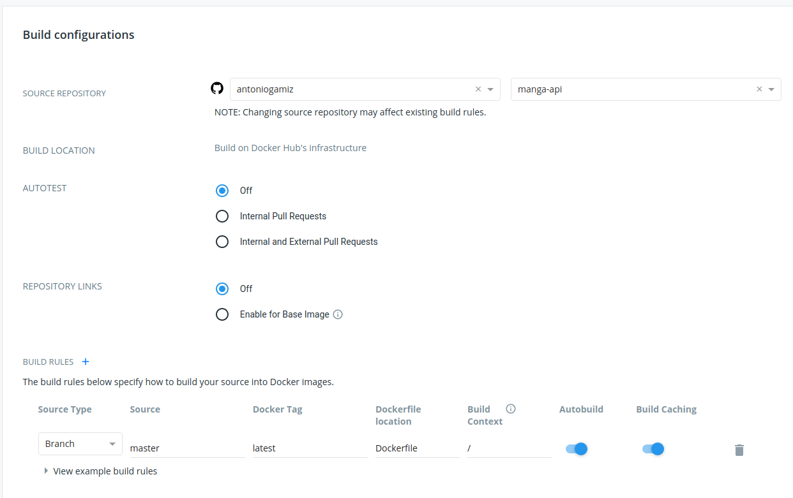
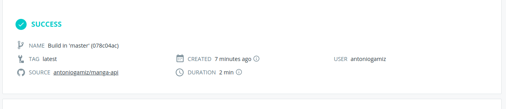
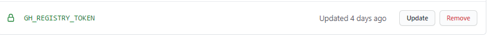
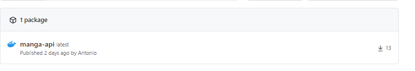

# Build automáticas de contenedores

Para desplegar automáticamente la última imagen de nuestro contenedor a Docker Hub tenemos varias opciones:

- Construirla en Github Actions y publicarla a Docker Hub.
- Configurar un trigger en Docker Hub para que cada vez que se haga un push a nuestra rama `master` se lance una build y se publique.

Al principio había implementado la opción 1, porque ofrece varias ventajas considerables:

- El tiempo de construcción en el entorno de las Actions es un poco más rápido que el de Docker Hub.
- Al construir la imagen en la misma Action, siempre puedo usar la versión más actualizada del contenedor, mientras que en Docker Hub las build van desfasadas porque los tests se corren siempre con la versión ya publicada.

La razón ya me parece de suficiente peso como para optar por esa opción solamente. De todas formas, al final he implementado las dos. En mi workflow uso el Github Registry para obtener las ventajas que ya he comentado y en Docker Hub uso las build automáticas.

Cierto es que al publicarlo con las build de Docker Hub, el `README.md` y el `Dockerfile` se publican de forma automática junto a tu repositorio, pero eso no es muy complejo de configurar desde actions.

## Docker Hub

La configuración no es muy compleja, simplemente hay que conectar el repositorio de Github con el repositorio de Docker Hub (no tengo captura de esto porque ya lo tenía hecho antes de escribir esto) y irse al apartado de Build y configurarlo:

Una vez hagamos push o la activemos manualmente, una build será lanzada y nuestro contenedor se construirá:

## Github Container Registry

Para publicar en el registro de GitHub, lo primero que necesitamos es un token con suficientes permisos (como explica [en este artículo](https://docs.github.com/es/free-pro-team@latest/packages/getting-started-with-github-container-registry/migrating-to-github-container-registry-for-docker-images)). Para ello simplemente hay que ir a `Settings`->`Developer Settings`->`Personal Access Token` y generar uno con los siguientes permisos:

Después hay que añadir ese token como secreto en nuestro repositorio (para que sea accesible por la Github Action): `Settings`->`Secrets`->`New secret`.

Una vez tenemos el secreto configurado, simplemente hay que usarlo (junto nuestro nick de github) para logearse en Github Container Registry, usando la acción [docker/login-action](https://github.com/docker/login-action):

~~~yml
    uses: docker/login-action@v1
    with:
        registry: ghcr.io
        username: ${{ github.repository_owner }}
        password: ${{ secrets.GH_REGISTRY_TOKEN }}
~~~

Una vez logeados, ya podemos construir y publicar la imagen al registo:

~~~yml
    - name: Push
      run: docker build -t ghcr.io/antoniogamiz/manga-api .
      run: docker push ghcr.io/antoniogamiz/manga-api
~~~

Si lo dejamos así, por defecto, el contenedor va a aparecer privado por defecto. Para cambiarlo, debes ir a tu página personal de Github, a `Packages` y cambiar la visibilidad a público:

