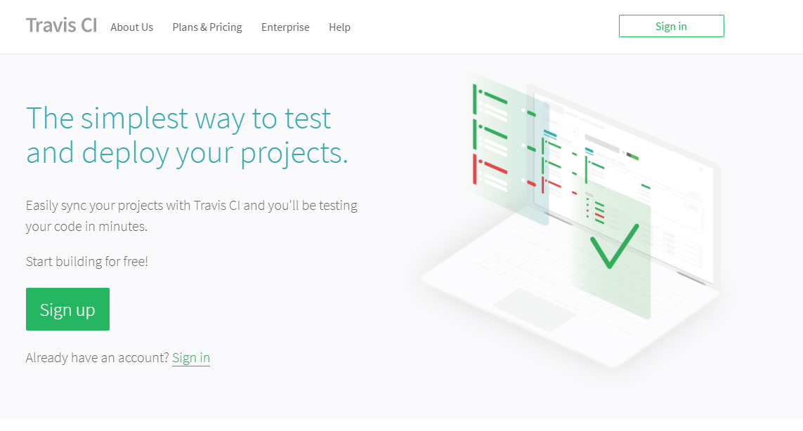
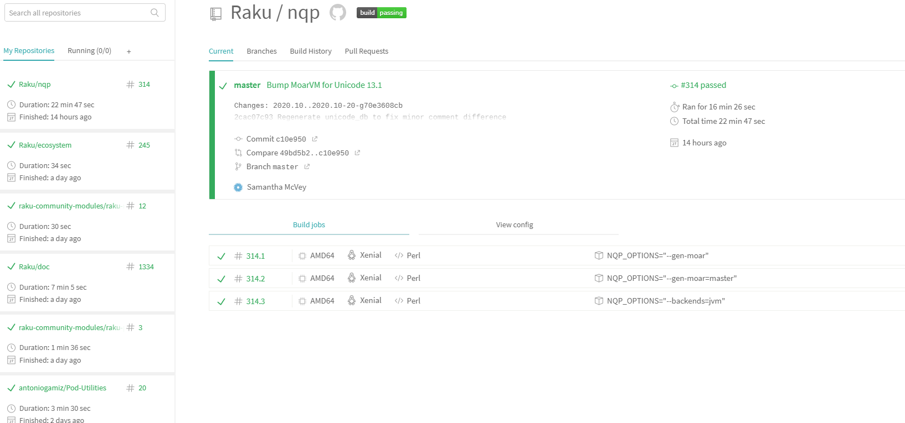
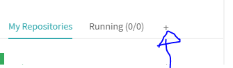
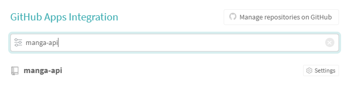
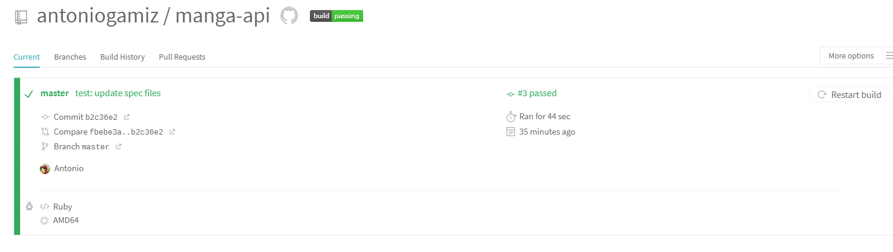
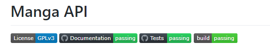

# Configuración integración continua

- [Travis](#travis)
- [GitHub Actions](#GitHub-Actions)
- [Extra](#Extra)

## Travis

1. Primeramente nos vamos a la página de Travis y nos logeamos (yo ya estoy registrado desde hace tiempo, así que ya tengo cuenta linkeada con GitHub):

Como se aprecia en esta captura, suelo usar Travis en otros proyectos. En concreto, los que aparecen ahí son de Raku, un lenguaje de programación.

2. Activar el repositorio en el que se vaya a aplicar la integración continua:

A mí ya me aparece el repositorio como añadido porque tengo Travis configurado para todos los repositorios de mi cuenta. Es decir, con crear un archivo `.travis.yml` en cualquiera de mis repositorios ya se activa una build.

3. Para configurar Deno en Travis tenemos dos opciones:

- Instalar Deno cada vez que ejecutemos una buid y cachearlo. Lo que se puede hacer fácilmente con el siguiente archivo de configuración:

    ~~~yml
    language: sh

    install:
      # descargamos e instalamos node
      - curl -fsSL https://deno.land/x/install/install.sh | sh
      # hacemos deno disponible como comando
      - export PATH="$HOME/.deno/bin:$PATH"
      # instalamos el task runner
      - deno install -qA -n vr https://deno.land/x/velociraptor@1.0.0-beta.16/cli.ts

    # ejecutamos los tests
    script:
      - vr test

    # cachemos la instalación de deno para acelerar futuras ejecuciones
    cache:
      directories:
        - '$HOME/.deno'
    ~~~

- Usar el contenedor de Docker creado en el hito anterior:

    ~~~yml
        services:
          - docker

        before_install:
          # cargamos el código de master
          - git checkout master
          # descargamos el contenedor de tests
          - docker pull ghcr.io/antoniogamiz/manga-api

        script:
          # ejecutamos los tests
          - docker run -t -v `pwd`:/test ghcr.io/antoniogamiz/manga-api
    ~~~

Solo tenemos estas dos opciones porque Deno no es oficialmente soportado por Travis todavía. Voy a optar por la segunda opción ya que así aprovecho el contenedor con todas las dependencias instaladas.

Como vemos, todo funciona correctamente:

## GitHub Actions

Yo ya tenía la integración continua configurada en Github Actions. Como Github Actions es un producto de GitHub, está integrado por defecto con todos los repositorios. Lo único que hace falta es crear un archivo `.yml` en `.github/workflows/` con la configuración del mismo. Actualmente tengo 3 workflows diferentes:

- `ci.yml`:
    ~~~yml
    name: Tests
    # se ejecuta en cada push
    on: [push]
    jobs:
    # este job comprueba cambios en archivos determinados para ver si es necesario reconstruir el contenedor de testeo. Estos archivos son, por ejemplo, el de dependencias, configuración de typescript o el mismo Dockerfile.
    # El job pone una variable global (disponible para todos los jobs) a true o false, dependiendo de sí hay que reconstruir o no
    shouldBuild:
        runs-on: ubuntu-latest
        outputs:
            changed: ${{ steps.shouldBuild.outputs.files }}
        steps:
            - uses: actions/checkout@v2
            - uses: dorny/paths-filter@v2
                id: shouldBuild
                with:
                filters: |
                    files:
                    - 'Dockerfile'
                    - 'src/deps.ts'
                    - 'scripts.yaml'
                    - 'tsconfig.json'
                    - '.github/workflows/ci.yml'
    # esta acción reconstruye y publica el contenedor si el resultado del job anterior así lo indica
    build:
        needs: shouldBuild
        runs-on: ubuntu-latest
        if: ${{ needs.shouldBuild.outputs.changed == 'true' }}
        steps:
            - uses: actions/checkout@v2
            - name: Publish to GitHub Container Registry
                uses: docker/login-action@v1
                with:
                registry: ghcr.io
                username: ${{ github.repository_owner }}
                password: ${{ secrets.GH_REGISTRY_TOKEN }}
            - name: Push
                run: docker build -t ghcr.io/antoniogamiz/manga-api . && docker push ghcr.io/antoniogamiz/manga-api
    # esta acción simplemente ejecuta los tests aprovechando el contenedor creado por el job anterior.
    run-tests:
        needs: [build, shouldBuild]
        if: always()
        runs-on: ubuntu-latest
        steps:
            - name: Checkout module
                uses: actions/checkout@v2
            - name: Run tests
                run: docker run -t -v `pwd`:/test ghcr.io/antoniogamiz/manga-api
    ~~~
- `documentation.yml`: publica la documentación actualizada a `gh-pages`, después de cada push a `master`.
    ~~~yml
    name: Documentation
    # ejecutamos el workflow en cada push
    on: [push]
    jobs:
    build-and-deploy:
        runs-on: ubuntu-latest
        steps:
        # hacemos checkout del código
        - name: Checkout 🛎️
            uses: actions/checkout@v2.3.1
            with:
            persist-credentials: false
        # hacemos setup de node. Aunque usemos Deno, la herramienta para crear la documentación (typedoc) funcione en Node (pero no en Deno)
        - uses: actions/setup-node@v2-beta
            with:
            node-version: "12"
        # instalamos las dependencias necesarias para generar la documentación
        - name: Install and Build 🔧
            run: |
            npm install -g typescript typedoc typescript-deno-plugin
            typedoc --ignoreCompilerErrors src/
            # es necesario para desactivar jekyll y que los enlaces generados por typedoc funcionen conrrectamente
            touch docs-build/.nojekyll

        # hacemos deploy usando una acción determinada para ello
        - name: Deploy 🚀
            uses: JamesIves/github-pages-deploy-action@3.6.2
            with:
            GITHUB_TOKEN: ${{ secrets.GITHUB_TOKEN }}
            BRANCH: gh-pages
            # aquí se han creado los documentos
            FOLDER: docs-build
            # borra lo que había antes en la rama
            CLEAN: true
            # borra todos los commits y deja el último solamente
            SINGLE_COMMIT: true
    ~~~
- `spell.yml`: este comprueba la ortografía del README y fue escrito por JJ, profesor de la asignatura.

## Extra

No se pedía y tampoco sirve de mucho, pero he añadido los badge de los dos sitios de integración continua al README:

