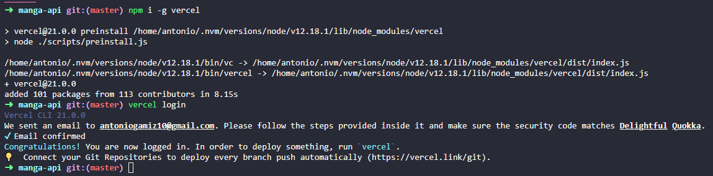
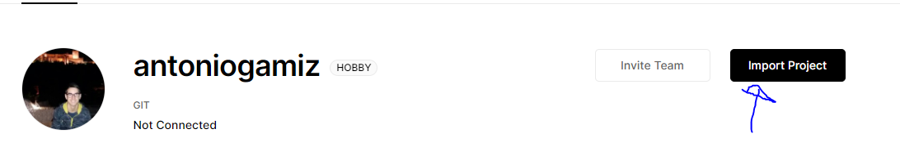
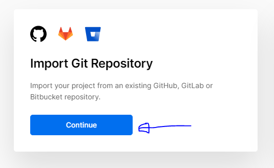
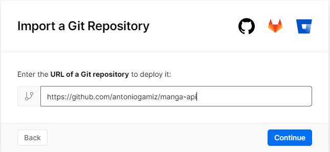
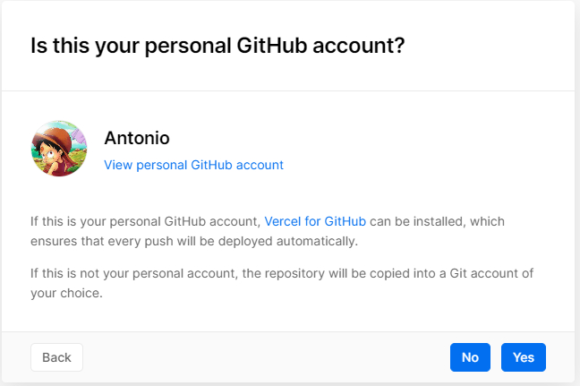
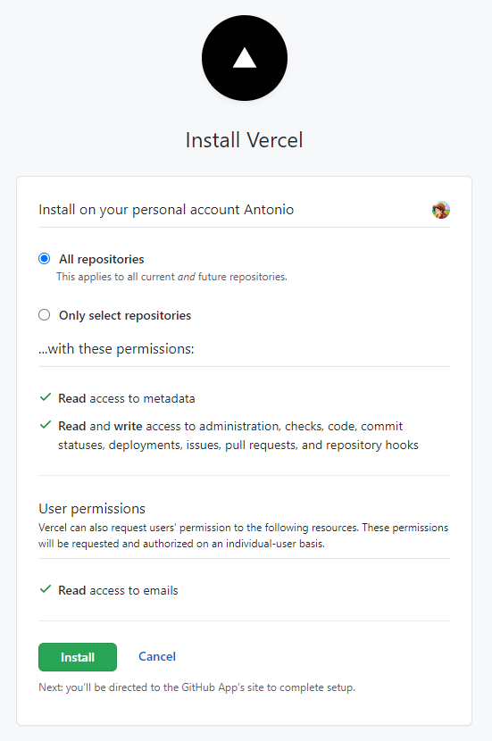
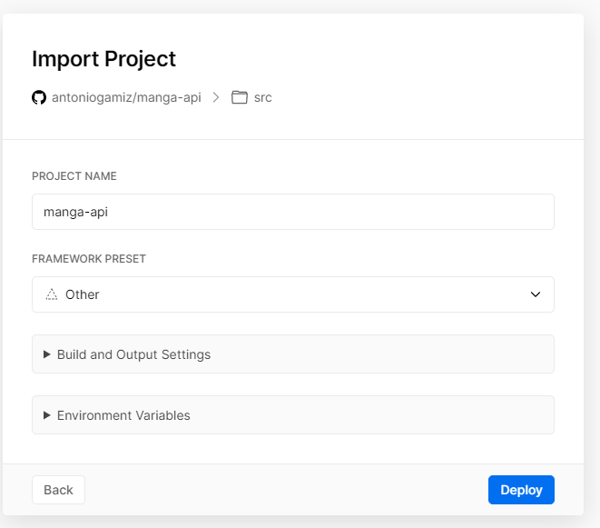
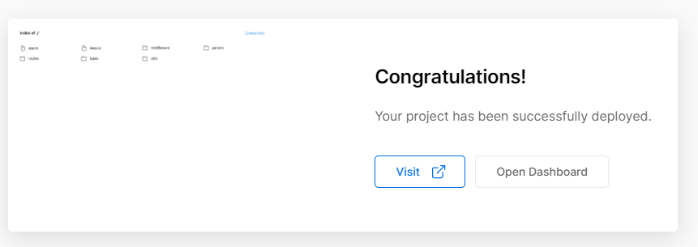
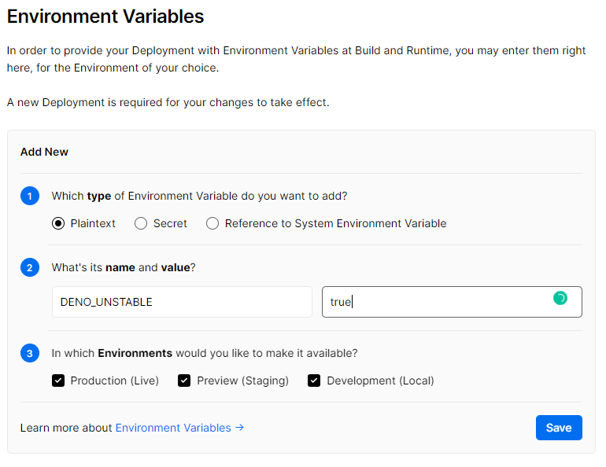

# Serverless

## Configuración

Primero tenemos que instalar el cli `vercel` y logearnos en nuestra cuenta:

Posteriormente, tenemos que conectar nuestro repositorio con `vercel`:

Finalmente, hacemos nuestro primer deployment:

Por ahora, nuestro [sitio](https://manga-api-zeta.vercel.app/) no tiene ninguna función definida, así que habrá que crearlas.

## Functions

Al ser `Deno` un lenguaje relativamente nuevo, su soporte es un poco escaso. Por ejemplo, [netlify no lo soporta](https://community.netlify.com/t/support-for-deno-on-netlify/14172) y `vercel` tiene una [runtime mantenida por la comunidad](https://github.com/TooTallNate/vercel-deno). Por esa razón, voy a intentar desplegar mi API Rest en `vercel` y luego hacer un bot de Telegram en Netlify para accederla.

Aquí tenemos que realiar una configuración adicional, ya que en nuestra usamos características de Deno que todavía no son estables, tenemos que definir, como indica la [documentación](https://github.com/TooTallNate/vercel-deno#configuration), el flag `--unstable`:

Para usar el runtime mantenido por la comunidad, basta con añadir lo siguiente a nuestro archivo `vercel.json`:

~~~json
{
    "functions": {
        "api/**/*.[jt]s": {
            "runtime": "vercel-deno@0.7.5"
        }
    }
}
~~~

### Health Endpoint

Primero vamos a crear una pequeña función de status, para ver si todo va bien. Para ello simplemente creamos un archivo [api/health.ts](https://github.com/antoniogamiz/manga-api/blob/master/api/health.ts), donde definimos nuestra función, y el archivo [vercel.json](https://github.com/antoniogamiz/manga-api/blob/master/vercel.json), donde indicamos donde están nuestras funciones.

Haciendo una petición a `https://manga-api.antoniogamiz.vercel.app/api/health`, se puede comprobar que todo funciona correctamente:

~~~
$  curl -D- https://manga-api.antoniogamiz.vercel.app/api/health
HTTP/2 200
date: Sun, 22 Nov 2020 08:20:22 GMT
x-robots-tag: noindex
cache-control: public, max-age=0, must-revalidate
content-length: 0
x-vercel-cache: MISS
age: 0
server: Vercel
x-vercel-id: cdg1::sfo1::vwgqw-1606033222436-7c7e262dcfc6
strict-transport-security: max-age=63072000; includeSubDomains; preload
~~~

### API Rest

Como ya tengo un objeto definido, [app.ts](https://github.com/antoniogamiz/manga-api/blob/master/src/app.ts), con la información de todas mis rutas y los middleware necesarios, en lugar de crear una función nueva para cada uno de esos endpoints, voy a crear un redireccionamiento a esos endpoints.

Para ello, creo una nueva función llamada [manga-api.ts](https://github.com/antoniogamiz/manga-api/blob/master/api/manga-api.ts):

~~~ts
import { ServerRequest } from "https://deno.land/std@0.73.0/http/server.ts";
import { Response } from "../src/deps.ts";

import app from "../src/app.ts";

export default async (req: ServerRequest) => {
  req.url = req.url.replace("/api", "");
  const body = (await app.handle(req))?.body;
  req.respond({ body: body });
};
~~~

Cuyo único objetivo es quitar la parte de `/api` de la URL y llamar a nuestro objeto `app`. Ahoar ya solo necesitamos redireccionar todas las peticiones de nuestra función correctamente. Para ello, usamos la regla `rewrites` en `vercel.json`:

~~~json
    "rewrites": [
        {
            "source": "/api/(.*)",
            "destination": "/api/manga-api.ts"
        }
    ]
~~~

Con esto ya estaría nuestra API Rest desplegada totalmente con una función serverless. Puedes visitar [este link](https://manga-api-zeta.vercel.app/api/mangas/xtbw261401566264968/) para comprobar que funciona correctamente (recomiendo instalar la extensión `JSON Viewer` en Chrome).

En el fichero [iv.yaml](https://github.com/antoniogamiz/manga-api/blob/master/iv.yaml) he añadido este ejemplo y en el fichero [5.json](https://github.com/antoniogamiz/manga-api/blob/master/5.json) he añadido el resultado esperado.